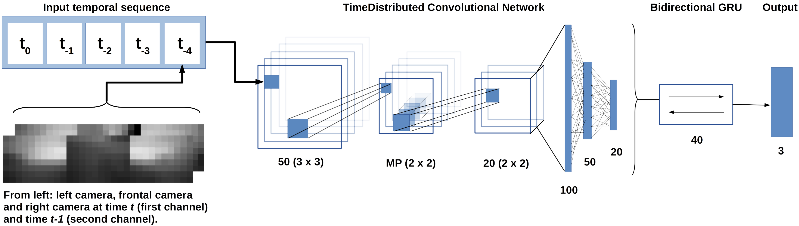

# OCELLIMAV-Project
OCELLIMAV Project data and scripts.

  

## Information
This proyect contains OCELLIMAV Proyect data and scripts. This proyect was partially supported by MINECO (Spain) grant OCELLIMAV (TEC-61708-EXP). For more information about this work please check paper: 

*Bioinspired Direct Visual Estimation of Attitude Rates with Very Low Resolution Images using Deep Networks* by M.Mérida-Floriano, F.Caballero, D.Acedo, D.García-Morales, L.Casares and L.Merino. Submmited to the 2019 IEEE International Conference on Robotics and Automation (ICRA 2019) 

Data processing was compute with Numpy and OpenCV on Python2.7. Neural Network was trained and tested using Keras2.0 with Theano backend.

## Resume

  

In this work we present a bioinspired visual system sensor to estimate angular rates in unmanned aerial vehicles (UAV) using Neural Networks. We have conceived a hardware setup to emulate *Drosophila*'s ocellar system, three simple eyes related to stabilization. This device is composed of three low resolution cameras with a similar spatial configuration as the ocelli.

  

We have recreated this device in a simulated environment using Airsim to capture synthethic data. Experiments were recorded by hand performing rotations on three axis.

There have been previous approaches based on this ocellar system, most of them considering assumptions such as known light source direction or a punctual light source. In contrast, here we present a learning approach using Artificial Neural Networks in order to recover the system's angular rates indoors and outdoors without previous knowledge. About network structure, we propose a CNNBiGRU architecture.

  

With this network we are able to recover angular rates in three axis both with synthetic and real data.

  

A classical computer vision based method is also derived to be used as a benchmark for the learning approach. The method is validated with a large dataset of images (more than **500M** samples) including synthetic and real data.

## Structure and contents
In the following folders you will find data and scripts to reproduce our experiments and results. About folders and its contents:

### ./data:
You will find the pre-processing data script and links to real and synthetic datasets. In README file sets and processed data are explained.

### ./scripts:
In this folder you will find four Python scripts: one for training the CNNBiGRU network proposed in the paper with synthetic datasets (`simulation_training.py`) and the corresponding testing script, to test the model with synthetic data (`simulation_testing.py`); another one (`fine_tune_training.py`) for re-training the synthetic model with real data and the last script (`fine_tune_testing.py`) test the final model. 
  
### ./models:
Two trained networks in `.hdf5` format: `synthetic_model.hdf5` is the network trained from scratch only with synthetic data sets and `real_model.hdf5`, the previous model fine-tuned with real sets.

### ./geometry_approach: 
This folder contains ROS Kinetic module that implements a non-linear optimizer to estimate the Ocelli rotation based on direct observation of the pixels. 

### ./BIAS_estimation:
A folder with scripts to reproduce BIAS estimation experiment described in the paper.
