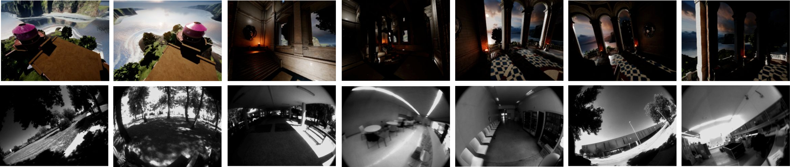

# OCELLIMAV dataset overview
Gray-scale and RGB images of 320x240 (original) and 10x8 pixels (processed), and angular rates from IMU measurements in both indoor and outdoor sceenarios, for simulated and real environments. Our dataset contains more than **500M** samples (comprised of three images and three angular rates). In synthetic data, recorded with AirSim, we considered 5 different illumination setting in indoor and outdoor scenarios: a temple sourrended by water and mountains. About indoor real data, we considered a building's hall with corridors and coffee machine, a dining room and a robotics laboratory. About outdoor real scenario, we captured data in a porch, under open sky and under a tree, with roads, car and people. 

In order to access original and processed data, please consult the following link: https://robotics.upo.es/datasets/ocellimav/

You will find a folder with original data (synthetic and real cases). Each of these folders contains three sub-folders, one per camera, and a `data.txt` file with IMU measurements that is used to process data. In addition you will also find a folder with processed data, containing `.npz` files used to train and test CNNBiGRU network.

## Synthetic data

131 datasets, organized in `synthetic_data` folders as follow (in order):

- 35 first sets in outdoor scenario with fixed light source (the Sun) direction.
- 11 sets in outdoor scenario changing light source direction.
- 30 sets in indoor scenario with 11 simultaneous light sources.
- 20 sets in indoor scenario with 6 light sources. 
- 35 last sets in indoor scenario with windows (a porch), changing the external light direction.

## Real data

24 datasets, in `real_data` folders as follow:

- 11 first sets in purely outdoor scenario.
- 1 set in a porch.
- 8 sets in indoor scenario.
- 4 last sets in indoor scenario only with pure translations.

# Preprocessing

About data preprocessing, please consult the file `processing_data.py`, that applies to every folder with original data. This script takes the three images with 320x240 pixels and generates downsampled and blurred images with 10x8 pixels. About labels, we substract the IMU's bias and compute a Savitzky-Golay filter. We obtain a `.npz` file per experiment. This format is NumPy zipped archive containing `.npy`files, they can be loaded with `numpy.load(name.npz)` (for more information about this format, please consult the following web: https://docs.scipy.org/doc/numpy/reference/generated/numpy.savez.html). Here there is a relation of the internal structures contained in `.npz` files, following the notation `[num_samples, seq_lenght, channels, width, height]`.

- simple_inputs: 
Input data structure (not used to train the network). Input downsampled and blurred pixels images from the three cameras are arranged as an array with shape `[samples, 2, 8, 30]`. First `[8, 10]` pixels are from Left camera, next 10 pixels are from
Front camera and last `[8, 10]` pixels are from Right camera. First channel is the composed image at time *t*, second channel is
the same composed image at time *t-1*.

- inputs_seq:
Input data structure used to train the network. This structure contains "simple_inputs" data sequenced, with shape `[samples, 5, 2, 8, 30]`, where the sequence's length is five. Temporal sequence is organized as follows: first element is an image of shape `[2, 8, 30]`  at time *T*, second element is an image at time *T-1*, etc. Each of the elements also contains temporal information organized by channels (see "simple_inputs").

- labels:
Ground-truth data structure. Data dimensions are `[samples, 3]`, where first column is the ground-truth label angular rate in x-axis recorder by the IMU, second column is angular rate in y-axis and third column is angular rate in z-axis.

- rates:
Information data about the frame rate of each experiment.

